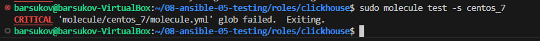

# Домашнее задание к занятию 5 «Тестирование roles» Барсуков А.А

## Подготовка к выполнению

1. Установите molecule и его драйвера: `pip3 install "molecule molecule_docker molecule_podman`.
2. Выполните `docker pull aragast/netology:latest` —  это образ с podman, tox и несколькими пайтонами (3.7 и 3.9) внутри.

## Основная часть

Ваша цель — настроить тестирование ваших ролей. 

Задача — сделать сценарии тестирования для vector. 

Ожидаемый результат — все сценарии успешно проходят тестирование ролей.

### Molecule

1. Запустите  `molecule test -s ubuntu_xenial` (или с любым другим сценарием, не имеет значения) внутри корневой директории clickhouse-role, посмотрите на вывод команды. Данная команда может отработать с ошибками или не отработать вовсе, это нормально. Наша цель - посмотреть как другие в реальном мире используют молекулу И из чего может состоять сценарий тестирования.
2. Перейдите в каталог с ролью vector-role и создайте сценарий тестирования по умолчанию при помощи `molecule init scenario --driver-name docker`.
3. Добавьте несколько разных дистрибутивов (oraclelinux:8, ubuntu:latest) для инстансов и протестируйте роль, исправьте найденные ошибки, если они есть.
4. Добавьте несколько assert в verify.yml-файл для  проверки работоспособности vector-role (проверка, что конфиг валидный, проверка успешности запуска и др.). 
5. Запустите тестирование роли повторно и проверьте, что оно прошло успешно.
5. Добавьте новый тег на коммит с рабочим сценарием в соответствии с семантическим версионированием.

### Tox

1. Добавьте в директорию с vector-role файлы из [директории](./example).
2. Запустите `docker run --privileged=True -v <path_to_repo>:/opt/vector-role -w /opt/vector-role -it aragast/netology:latest /bin/bash`, где path_to_repo — путь до корня репозитория с vector-role на вашей файловой системе.
3. Внутри контейнера выполните команду `tox`, посмотрите на вывод.
5. Создайте облегчённый сценарий для `molecule` с драйвером `molecule_podman`. Проверьте его на исполнимость.
6. Пропишите правильную команду в `tox.ini`, чтобы запускался облегчённый сценарий.
8. Запустите команду `tox`. Убедитесь, что всё отработало успешно.
9. Добавьте новый тег на коммит с рабочим сценарием в соответствии с семантическим версионированием.

После выполнения у вас должно получится два сценария molecule и один tox.ini файл в репозитории. Не забудьте указать в ответе теги решений Tox и Molecule заданий. В качестве решения пришлите ссылку на  ваш репозиторий и скриншоты этапов выполнения задания. 

## Необязательная часть

1. Проделайте схожие манипуляции для создания роли LightHouse.
2. Создайте сценарий внутри любой из своих ролей, который умеет поднимать весь стек при помощи всех ролей.
3. Убедитесь в работоспособности своего стека. Создайте отдельный verify.yml, который будет проверять работоспособность интеграции всех инструментов между ними.
4. Выложите свои roles в репозитории.

В качестве решения пришлите ссылки и скриншоты этапов выполнения задания.

---

### Как оформить решение задания

Выполненное домашнее задание пришлите в виде ссылки на .md-файл в вашем репозитории.


### Решение

1


2


Для тестирования выполняем команду `molecule test --driver-name docker`:  

<details>


<summary>результат выполнения команды: molecule test --driver-name docker </summary>

```shell  
barsukov@barsukov-VirtualBox:~/08-ansible-05-testing/roles/vector-role$ sudo molecule test --driver-name docker
WARNING  Driver docker does not provide a schema.
WARNING  Driver docker does not provide a schema.
INFO     default ➜ discovery: scenario test matrix: dependency, cleanup, destroy, syntax, create, prepare, converge, idempotence, side_effect, verify, cleanup, destroy
INFO     default ➜ prerun: Performing prerun with role_name_check=0...
INFO     default ➜ dependency: Starting
WARNING  default ➜ dependency: Skipping, missing the requirements file.
WARNING  default ➜ dependency: Skipping, missing the requirements file.
INFO     default ➜ dependency: Completed
INFO     default ➜ cleanup: Starting
WARNING  default ➜ cleanup: Skipping, cleanup playbook not configured.
INFO     default ➜ cleanup: Completed
INFO     default ➜ destroy: Starting
INFO     default ➜ destroy: ansible-playbook version: ansible-playbook 
  config file = None
  configured module search path = ['/root/.ansible/plugins/modules', '/usr/share/ansible/plugins/modules']
  ansible python module location = /usr/lib/python3/dist-packages/ansible
  ansible collection location = /root/.ansible/collections:/usr/share/ansible/collections
  executable location = /usr/bin/ansible-playbook
  python version = 3.12.3 (main, Aug 14 2025, 17:47:21)  (/usr/bin/python3)
  jinja version = 3.1.2
  libyaml = True
INFO     Sanity checks: 'docker'

PLAY [Destroy] *****************************************************************

TASK [Set async_dir for HOME env] **********************************************
ok: [localhost]

TASK [Destroy molecule instance(s)] ********************************************
changed: [localhost] => (item=instance)

TASK [Wait for instance(s) deletion to complete] *******************************
FAILED - RETRYING: [localhost]: Wait for instance(s) deletion to complete (300 retries left).
ok: [localhost] => (item=instance)

TASK [Delete docker networks(s)] ***********************************************
skipping: [localhost]

PLAY RECAP *********************************************************************
localhost                  : ok=3    changed=1    unreachable=0    failed=0    skipped=1    rescued=0    ignored=0

INFO     default ➜ destroy: Completed
INFO     default ➜ syntax: Starting
INFO     default ➜ syntax: ansible-playbook version: ansible-playbook 
  config file = None
  configured module search path = ['/root/.ansible/plugins/modules', '/usr/share/ansible/plugins/modules']
  ansible python module location = /usr/lib/python3/dist-packages/ansible
  ansible collection location = /root/.ansible/collections:/usr/share/ansible/collections
  executable location = /usr/bin/ansible-playbook
  python version = 3.12.3 (main, Aug 14 2025, 17:47:21)  (/usr/bin/python3)
  jinja version = 3.1.2
  libyaml = True

playbook: /home/barsukov/08-ansible-05-testing/roles/vector-role/molecule/default/converge.yml
INFO     default ➜ syntax: Completed
INFO     default ➜ create: Starting
INFO     default ➜ create: ansible-playbook version: ansible-playbook 
  config file = None
  configured module search path = ['/root/.ansible/plugins/modules', '/usr/share/ansible/plugins/modules']
  ansible python module location = /usr/lib/python3/dist-packages/ansible
  ansible collection location = /root/.ansible/collections:/usr/share/ansible/collections
  executable location = /usr/bin/ansible-playbook
  python version = 3.12.3 (main, Aug 14 2025, 17:47:21)  (/usr/bin/python3)
  jinja version = 3.1.2
  libyaml = True

PLAY [Create] ******************************************************************

TASK [Set async_dir for HOME env] **********************************************
ok: [localhost]

TASK [Log into a Docker registry] **********************************************
skipping: [localhost] => (item=None) 
skipping: [localhost]

TASK [Check presence of custom Dockerfiles] ************************************
ok: [localhost] => (item=instance)

TASK [Create Dockerfiles from image names] *************************************
skipping: [localhost] => (item=instance) 
skipping: [localhost]

TASK [Synchronization the context] *********************************************
skipping: [localhost] => (item=instance) 
skipping: [localhost]

TASK [Discover local Docker images] ********************************************
ok: [localhost] => (item=unix://var/run/docker.sock)

TASK [Create docker network(s)] ************************************************
skipping: [localhost]

TASK [Build an Ansible compatible image (new)] *********************************
skipping: [localhost] => (item=molecule_local/quay.io/centos/centos:stream8) 
skipping: [localhost]

TASK [Determine the CMD directives] ********************************************
ok: [localhost] => (item=instance)

TASK [Create molecule instance(s)] *********************************************
changed: [localhost] => (item=instance)

TASK [Wait for instance(s) creation to complete] *******************************
FAILED - RETRYING: [localhost]: Wait for instance(s) creation to complete (300 retries left).
FAILED - RETRYING: [localhost]: Wait for instance(s) creation to complete (299 retries left).
FAILED - RETRYING: [localhost]: Wait for instance(s) creation to complete (298 retries left).
FAILED - RETRYING: [localhost]: Wait for instance(s) creation to complete (297 retries left).
FAILED - RETRYING: [localhost]: Wait for instance(s) creation to complete (296 retries left).
changed: [localhost] => (item=instance)

PLAY RECAP *********************************************************************
localhost                  : ok=6    changed=2    unreachable=0    failed=0    skipped=5    rescued=0    ignored=0

INFO     default ➜ create: Completed
INFO     default ➜ prepare: Starting
WARNING  default ➜ prepare: Skipping, prepare playbook not configured.
INFO     default ➜ prepare: Completed
INFO     default ➜ converge: Starting
INFO     default ➜ converge: ansible-playbook version: ansible-playbook 
  config file = None
  configured module search path = ['/root/.ansible/plugins/modules', '/usr/share/ansible/plugins/modules']
  ansible python module location = /usr/lib/python3/dist-packages/ansible
  ansible collection location = /root/.ansible/collections:/usr/share/ansible/collections
  executable location = /usr/bin/ansible-playbook
  python version = 3.12.3 (main, Aug 14 2025, 17:47:21)  (/usr/bin/python3)
  jinja version = 3.1.2
  libyaml = True

PLAY [Converge] ****************************************************************

TASK [Replace this task with one that validates your content] ******************
ok: [instance] => {
    "msg": "This is the effective test"
}

PLAY RECAP *********************************************************************
instance                   : ok=1    changed=0    unreachable=0    failed=0    skipped=0    rescued=0    ignored=0

INFO     default ➜ converge: Completed
INFO     default ➜ idempotence: Starting
INFO     default ➜ idempotence: ansible-playbook version: ansible-playbook 
  config file = None
  configured module search path = ['/root/.ansible/plugins/modules', '/usr/share/ansible/plugins/modules']
  ansible python module location = /usr/lib/python3/dist-packages/ansible
  ansible collection location = /root/.ansible/collections:/usr/share/ansible/collections
  executable location = /usr/bin/ansible-playbook
  python version = 3.12.3 (main, Aug 14 2025, 17:47:21)  (/usr/bin/python3)
  jinja version = 3.1.2
  libyaml = True

PLAY [Converge] ****************************************************************

TASK [Replace this task with one that validates your content] ******************
ok: [instance] => {
    "msg": "This is the effective test"
}

PLAY RECAP *********************************************************************
instance                   : ok=1    changed=0    unreachable=0    failed=0    skipped=0    rescued=0    ignored=0

INFO     default ➜ idempotence: Idempotence completed successfully.
INFO     default ➜ idempotence: Completed
INFO     default ➜ side_effect: Starting
WARNING  default ➜ sideeffect: Skipping, side effect playbook not configured.
INFO     default ➜ side_effect: Completed
INFO     default ➜ verify: Starting
INFO     default ➜ verify: Running Ansible Verifier
WARNING  default ➜ verify: Skipping, verify playbook not configured.
INFO     default ➜ verify: Verifier completed successfully.
INFO     default ➜ verify: Completed
INFO     default ➜ cleanup: Starting
WARNING  default ➜ cleanup: Skipping, cleanup playbook not configured.
INFO     default ➜ cleanup: Completed
INFO     default ➜ destroy: Starting
INFO     default ➜ destroy: ansible-playbook version: ansible-playbook 
  config file = None
  configured module search path = ['/root/.ansible/plugins/modules', '/usr/share/ansible/plugins/modules']
  ansible python module location = /usr/lib/python3/dist-packages/ansible
  ansible collection location = /root/.ansible/collections:/usr/share/ansible/collections
  executable location = /usr/bin/ansible-playbook
  python version = 3.12.3 (main, Aug 14 2025, 17:47:21)  (/usr/bin/python3)
  jinja version = 3.1.2
  libyaml = True

PLAY [Destroy] *****************************************************************

TASK [Set async_dir for HOME env] **********************************************
ok: [localhost]

TASK [Destroy molecule instance(s)] ********************************************
changed: [localhost] => (item=instance)

TASK [Wait for instance(s) deletion to complete] *******************************
FAILED - RETRYING: [localhost]: Wait for instance(s) deletion to complete (300 retries left).
changed: [localhost] => (item=instance)

TASK [Delete docker networks(s)] ***********************************************
skipping: [localhost]

PLAY RECAP *********************************************************************
localhost                  : ok=3    changed=2    unreachable=0    failed=0    skipped=1    rescued=0    ignored=0

INFO     default ➜ destroy: Completed
INFO     default ➜ scenario: Pruning extra files from scenario ephemeral directory
```
</details>  


#### 4. Добавьте несколько assert в verify.yml-файл для проверки работоспособности vector-role (проверка, что конфиг валидный, проверка успешности запуска и др.).  

```yml
# default/verify.yml
---
- name: Verify
  hosts: all
  gather_facts: false
  tasks:
  - name: Example assertion
    assert:
      that: true
```  
  
#### 5. Запустите тестирование роли повторно и проверьте, что оно прошло успешно. 


Для тестирования выполняем команду `molecule test --driver-name docker`:  

<details>

<summary>результат выполнения команды: molecule test --driver-name docker </summary>

```shell 
molecule init scenario --driver-name docker
Driver 'docker' not available.

Install cloud drivers with:
  pip install molecule-plugins

Currently available drivers: ['default']

Aborted!
barsukov@barsukov-VirtualBox:~/08-ansible-05-testing/roles/vector-role$ ыгвщ molecule init scenario --driver-name docker
ыгвщ: command not found
barsukov@barsukov-VirtualBox:~/08-ansible-05-testing/roles/vector-role$ sudo molecule init scenario --driver-name docker
[sudo] password for barsukov: 
INFO     default ➜ init: Initializing new scenario default...

PLAY [Create a new molecule scenario] ******************************************

TASK [Check if destination folder exists] **************************************
changed: [localhost]

TASK [Check if destination folder is empty] ************************************
ok: [localhost]

TASK [Fail if destination folder is not empty] *********************************
skipping: [localhost]

TASK [Expand templates] ********************************************************
changed: [localhost] => (item=molecule/default/molecule.yml)
skipping: [localhost] => (item=molecule/default/destroy.yml) 
changed: [localhost] => (item=molecule/default/converge.yml)
skipping: [localhost] => (item=molecule/default/create.yml) 

PLAY RECAP *********************************************************************
localhost                  : ok=3    changed=2    unreachable=0    failed=0    skipped=1    rescued=0    ignored=0

INFO     default ➜ init: Initialized scenario in /home/barsukov/08-ansible-05-testing/roles/vector-role/molecule/default successfully.
barsukov@barsukov-VirtualBox:~/08-ansible-05-testing/roles/vector-role$ cd molecule/
bash: cd: molecule/: Permission denied
barsukov@barsukov-VirtualBox:~/08-ansible-05-testing/roles/vector-role$ ch
chacl                   chardetect              chcon                   chfn                    chmem                   chown                   chrt
chage                   chat                    chcpu                   chgpasswd               chmod                   chpasswd                chsh
chardet                 chattr                  check-language-support  chgrp                   choom                   chroot                  chvt
barsukov@barsukov-VirtualBox:~/08-ansible-05-testing/roles/vector-role$ chm
chmem  chmod  
barsukov@barsukov-VirtualBox:~/08-ansible-05-testing/roles/vector-role$ chm
chmem  chmod  
barsukov@barsukov-VirtualBox:~/08-ansible-05-testing/roles/vector-role$ sudo chmod 777 molecule/
barsukov@barsukov-VirtualBox:~/08-ansible-05-testing/roles/vector-role$ cd molecule/
barsukov@barsukov-VirtualBox:~/08-ansible-05-testing/roles/vector-role/molecule$ nano molecule.yml
barsukov@barsukov-VirtualBox:~/08-ansible-05-testing/roles/vector-role/molecule$ cd ..
barsukov@barsukov-VirtualBox:~/08-ansible-05-testing/roles/vector-role$ molecule test --driver-name docker
Usage: molecule test [OPTIONS] [ANSIBLE_ARGS]...
Try 'molecule test -h' for help.

Error: Invalid value for '--driver-name' / '-d': 'docker' is not 'default'.
barsukov@barsukov-VirtualBox:~/08-ansible-05-testing/roles/vector-role$ sudo molecule test --driver-name docker
WARNING  Driver docker does not provide a schema.
WARNING  Driver docker does not provide a schema.
INFO     default ➜ discovery: scenario test matrix: dependency, cleanup, destroy, syntax, create, prepare, converge, idempotence, side_effect, verify, cleanup, destroy
INFO     default ➜ prerun: Performing prerun with role_name_check=0...
INFO     default ➜ dependency: Starting
WARNING  default ➜ dependency: Skipping, missing the requirements file.
WARNING  default ➜ dependency: Skipping, missing the requirements file.
INFO     default ➜ dependency: Completed
INFO     default ➜ cleanup: Starting
WARNING  default ➜ cleanup: Skipping, cleanup playbook not configured.
INFO     default ➜ cleanup: Completed
INFO     default ➜ destroy: Starting
INFO     default ➜ destroy: ansible-playbook version: ansible-playbook 
  config file = None
  configured module search path = ['/root/.ansible/plugins/modules', '/usr/share/ansible/plugins/modules']
  ansible python module location = /usr/lib/python3/dist-packages/ansible
  ansible collection location = /root/.ansible/collections:/usr/share/ansible/collections
  executable location = /usr/bin/ansible-playbook
  python version = 3.12.3 (main, Aug 14 2025, 17:47:21)  (/usr/bin/python3)
  jinja version = 3.1.2
  libyaml = True
INFO     Sanity checks: 'docker'

PLAY [Destroy] *****************************************************************

TASK [Set async_dir for HOME env] **********************************************
ok: [localhost]

TASK [Destroy molecule instance(s)] ********************************************
changed: [localhost] => (item=instance)

TASK [Wait for instance(s) deletion to complete] *******************************
FAILED - RETRYING: [localhost]: Wait for instance(s) deletion to complete (300 retries left).
ok: [localhost] => (item=instance)

TASK [Delete docker networks(s)] ***********************************************
skipping: [localhost]

PLAY RECAP *********************************************************************
localhost                  : ok=3    changed=1    unreachable=0    failed=0    skipped=1    rescued=0    ignored=0

INFO     default ➜ destroy: Completed
INFO     default ➜ syntax: Starting
INFO     default ➜ syntax: ansible-playbook version: ansible-playbook 
  config file = None
  configured module search path = ['/root/.ansible/plugins/modules', '/usr/share/ansible/plugins/modules']
  ansible python module location = /usr/lib/python3/dist-packages/ansible
  ansible collection location = /root/.ansible/collections:/usr/share/ansible/collections
  executable location = /usr/bin/ansible-playbook
  python version = 3.12.3 (main, Aug 14 2025, 17:47:21)  (/usr/bin/python3)
  jinja version = 3.1.2
  libyaml = True

playbook: /home/barsukov/08-ansible-05-testing/roles/vector-role/molecule/default/converge.yml
INFO     default ➜ syntax: Completed
INFO     default ➜ create: Starting
INFO     default ➜ create: ansible-playbook version: ansible-playbook 
  config file = None
  configured module search path = ['/root/.ansible/plugins/modules', '/usr/share/ansible/plugins/modules']
  ansible python module location = /usr/lib/python3/dist-packages/ansible
  ansible collection location = /root/.ansible/collections:/usr/share/ansible/collections
  executable location = /usr/bin/ansible-playbook
  python version = 3.12.3 (main, Aug 14 2025, 17:47:21)  (/usr/bin/python3)
  jinja version = 3.1.2
  libyaml = True

PLAY [Create] ******************************************************************

TASK [Set async_dir for HOME env] **********************************************
ok: [localhost]

TASK [Log into a Docker registry] **********************************************
skipping: [localhost] => (item=None) 
skipping: [localhost]

TASK [Check presence of custom Dockerfiles] ************************************
ok: [localhost] => (item=instance)

TASK [Create Dockerfiles from image names] *************************************
skipping: [localhost] => (item=instance) 
skipping: [localhost]

TASK [Synchronization the context] *********************************************
skipping: [localhost] => (item=instance) 
skipping: [localhost]

TASK [Discover local Docker images] ********************************************
ok: [localhost] => (item=unix://var/run/docker.sock)

TASK [Create docker network(s)] ************************************************
skipping: [localhost]

TASK [Build an Ansible compatible image (new)] *********************************
skipping: [localhost] => (item=molecule_local/quay.io/centos/centos:stream8) 
skipping: [localhost]

TASK [Determine the CMD directives] ********************************************
ok: [localhost] => (item=instance)

TASK [Create molecule instance(s)] *********************************************
changed: [localhost] => (item=instance)

TASK [Wait for instance(s) creation to complete] *******************************
FAILED - RETRYING: [localhost]: Wait for instance(s) creation to complete (300 retries left).
FAILED - RETRYING: [localhost]: Wait for instance(s) creation to complete (299 retries left).
FAILED - RETRYING: [localhost]: Wait for instance(s) creation to complete (298 retries left).
FAILED - RETRYING: [localhost]: Wait for instance(s) creation to complete (297 retries left).
FAILED - RETRYING: [localhost]: Wait for instance(s) creation to complete (296 retries left).
changed: [localhost] => (item=instance)

PLAY RECAP *********************************************************************
localhost                  : ok=6    changed=2    unreachable=0    failed=0    skipped=5    rescued=0    ignored=0

INFO     default ➜ create: Completed
INFO     default ➜ prepare: Starting
WARNING  default ➜ prepare: Skipping, prepare playbook not configured.
INFO     default ➜ prepare: Completed
INFO     default ➜ converge: Starting
INFO     default ➜ converge: ansible-playbook version: ansible-playbook 
  config file = None
  configured module search path = ['/root/.ansible/plugins/modules', '/usr/share/ansible/plugins/modules']
  ansible python module location = /usr/lib/python3/dist-packages/ansible
  ansible collection location = /root/.ansible/collections:/usr/share/ansible/collections
  executable location = /usr/bin/ansible-playbook
  python version = 3.12.3 (main, Aug 14 2025, 17:47:21)  (/usr/bin/python3)
  jinja version = 3.1.2
  libyaml = True

PLAY [Converge] ****************************************************************

TASK [Replace this task with one that validates your content] ******************
ok: [instance] => {
    "msg": "This is the effective test"
}

PLAY RECAP *********************************************************************
instance                   : ok=1    changed=0    unreachable=0    failed=0    skipped=0    rescued=0    ignored=0

INFO     default ➜ converge: Completed
INFO     default ➜ idempotence: Starting
INFO     default ➜ idempotence: ansible-playbook version: ansible-playbook 
  config file = None
  configured module search path = ['/root/.ansible/plugins/modules', '/usr/share/ansible/plugins/modules']
  ansible python module location = /usr/lib/python3/dist-packages/ansible
  ansible collection location = /root/.ansible/collections:/usr/share/ansible/collections
  executable location = /usr/bin/ansible-playbook
  python version = 3.12.3 (main, Aug 14 2025, 17:47:21)  (/usr/bin/python3)
  jinja version = 3.1.2
  libyaml = True

PLAY [Converge] ****************************************************************

TASK [Replace this task with one that validates your content] ******************
ok: [instance] => {
    "msg": "This is the effective test"
}

PLAY RECAP *********************************************************************
instance                   : ok=1    changed=0    unreachable=0    failed=0    skipped=0    rescued=0    ignored=0

INFO     default ➜ idempotence: Idempotence completed successfully.
INFO     default ➜ idempotence: Completed
INFO     default ➜ side_effect: Starting
WARNING  default ➜ sideeffect: Skipping, side effect playbook not configured.
INFO     default ➜ side_effect: Completed
INFO     default ➜ verify: Starting
INFO     default ➜ verify: Running Ansible Verifier
WARNING  default ➜ verify: Skipping, verify playbook not configured.
INFO     default ➜ verify: Verifier completed successfully.
INFO     default ➜ verify: Completed
INFO     default ➜ cleanup: Starting
WARNING  default ➜ cleanup: Skipping, cleanup playbook not configured.
INFO     default ➜ cleanup: Completed
INFO     default ➜ destroy: Starting
INFO     default ➜ destroy: ansible-playbook version: ansible-playbook 
  config file = None
  configured module search path = ['/root/.ansible/plugins/modules', '/usr/share/ansible/plugins/modules']
  ansible python module location = /usr/lib/python3/dist-packages/ansible
  ansible collection location = /root/.ansible/collections:/usr/share/ansible/collections
  executable location = /usr/bin/ansible-playbook
  python version = 3.12.3 (main, Aug 14 2025, 17:47:21)  (/usr/bin/python3)
  jinja version = 3.1.2
  libyaml = True

PLAY [Destroy] *****************************************************************

TASK [Set async_dir for HOME env] **********************************************
ok: [localhost]

TASK [Destroy molecule instance(s)] ********************************************
changed: [localhost] => (item=instance)

TASK [Wait for instance(s) deletion to complete] *******************************
FAILED - RETRYING: [localhost]: Wait for instance(s) deletion to complete (300 retries left).
changed: [localhost] => (item=instance)

TASK [Delete docker networks(s)] ***********************************************
skipping: [localhost]

PLAY RECAP *********************************************************************
localhost                  : ok=3    changed=2    unreachable=0    failed=0    skipped=1    rescued=0    ignored=0

INFO     default ➜ destroy: Completed
INFO     default ➜ scenario: Pruning extra files from scenario ephemeral directory
barsukov@barsukov-VirtualBox:~/08-ansible-05-testing/roles/vector-role$ 
barsukov@barsukov-VirtualBox:~/08-ansible-05-testing/roles/vector-role$ sudo molecule test --driver-name docker
WARNING  Driver docker does not provide a schema.
WARNING  Driver docker does not provide a schema.
INFO     default ➜ discovery: scenario test matrix: dependency, cleanup, destroy, syntax, create, prepare, converge, idempotence, side_effect, verify, cleanup, destroy
INFO     default ➜ prerun: Performing prerun with role_name_check=0...
WARNING  Another version of 'community.docker' 3.7.0 was found installed in /usr/lib/python3/dist-packages/ansible_collections, only the first one will be used, 4.7.0 (/root/.ansible/collections/ansible_collections).
INFO     default ➜ dependency: Starting
WARNING  default ➜ dependency: Skipping, missing the requirements file.
WARNING  default ➜ dependency: Skipping, missing the requirements file.
INFO     default ➜ dependency: Completed
INFO     default ➜ cleanup: Starting
WARNING  default ➜ cleanup: Skipping, cleanup playbook not configured.
INFO     default ➜ cleanup: Completed
INFO     default ➜ destroy: Starting
INFO     default ➜ destroy: ansible-playbook version: ansible-playbook 
  config file = None
  configured module search path = ['/root/.ansible/plugins/modules', '/usr/share/ansible/plugins/modules']
  ansible python module location = /usr/lib/python3/dist-packages/ansible
  ansible collection location = /root/.ansible/collections:/usr/share/ansible/collections
  executable location = /usr/bin/ansible-playbook
  python version = 3.12.3 (main, Aug 14 2025, 17:47:21)  (/usr/bin/python3)
  jinja version = 3.1.2
  libyaml = True
INFO     Sanity checks: 'docker'

PLAY [Destroy] *****************************************************************

TASK [Set async_dir for HOME env] **********************************************
ok: [localhost]

TASK [Destroy molecule instance(s)] ********************************************
changed: [localhost] => (item=instance)

TASK [Wait for instance(s) deletion to complete] *******************************
FAILED - RETRYING: [localhost]: Wait for instance(s) deletion to complete (300 retries left).
ok: [localhost] => (item=instance)

TASK [Delete docker networks(s)] ***********************************************
skipping: [localhost]

PLAY RECAP *********************************************************************
localhost                  : ok=3    changed=1    unreachable=0    failed=0    skipped=1    rescued=0    ignored=0

INFO     default ➜ destroy: Completed
INFO     default ➜ syntax: Starting
INFO     default ➜ syntax: ansible-playbook version: ansible-playbook 
  config file = None
  configured module search path = ['/root/.ansible/plugins/modules', '/usr/share/ansible/plugins/modules']
  ansible python module location = /usr/lib/python3/dist-packages/ansible
  ansible collection location = /root/.ansible/collections:/usr/share/ansible/collections
  executable location = /usr/bin/ansible-playbook
  python version = 3.12.3 (main, Aug 14 2025, 17:47:21)  (/usr/bin/python3)
  jinja version = 3.1.2
  libyaml = True

playbook: /home/barsukov/08-ansible-05-testing/roles/vector-role/molecule/default/converge.yml
INFO     default ➜ syntax: Completed
INFO     default ➜ create: Starting
INFO     default ➜ create: ansible-playbook version: ansible-playbook 
  config file = None
  configured module search path = ['/root/.ansible/plugins/modules', '/usr/share/ansible/plugins/modules']
  ansible python module location = /usr/lib/python3/dist-packages/ansible
  ansible collection location = /root/.ansible/collections:/usr/share/ansible/collections
  executable location = /usr/bin/ansible-playbook
  python version = 3.12.3 (main, Aug 14 2025, 17:47:21)  (/usr/bin/python3)
  jinja version = 3.1.2
  libyaml = True

PLAY [Create] ******************************************************************

TASK [Set async_dir for HOME env] **********************************************
ok: [localhost]

TASK [Log into a Docker registry] **********************************************
skipping: [localhost] => (item=None) 
skipping: [localhost]

TASK [Check presence of custom Dockerfiles] ************************************
ok: [localhost] => (item=instance)

TASK [Create Dockerfiles from image names] *************************************
skipping: [localhost] => (item=instance) 
skipping: [localhost]

TASK [Synchronization the context] *********************************************
skipping: [localhost] => (item=instance) 
skipping: [localhost]

TASK [Discover local Docker images] ********************************************
ok: [localhost] => (item=unix://var/run/docker.sock)

TASK [Create docker network(s)] ************************************************
skipping: [localhost]

TASK [Build an Ansible compatible image (new)] *********************************
skipping: [localhost] => (item=molecule_local/quay.io/centos/centos:stream8) 
skipping: [localhost]

TASK [Determine the CMD directives] ********************************************
ok: [localhost] => (item=instance)

TASK [Create molecule instance(s)] *********************************************
changed: [localhost] => (item=instance)

TASK [Wait for instance(s) creation to complete] *******************************
FAILED - RETRYING: [localhost]: Wait for instance(s) creation to complete (300 retries left).
changed: [localhost] => (item=instance)

PLAY RECAP *********************************************************************
localhost                  : ok=6    changed=2    unreachable=0    failed=0    skipped=5    rescued=0    ignored=0

INFO     default ➜ create: Completed
INFO     default ➜ prepare: Starting
WARNING  default ➜ prepare: Skipping, prepare playbook not configured.
INFO     default ➜ prepare: Completed
INFO     default ➜ converge: Starting
INFO     default ➜ converge: ansible-playbook version: ansible-playbook 
  config file = None
  configured module search path = ['/root/.ansible/plugins/modules', '/usr/share/ansible/plugins/modules']
  ansible python module location = /usr/lib/python3/dist-packages/ansible
  ansible collection location = /root/.ansible/collections:/usr/share/ansible/collections
  executable location = /usr/bin/ansible-playbook
  python version = 3.12.3 (main, Aug 14 2025, 17:47:21)  (/usr/bin/python3)
  jinja version = 3.1.2
  libyaml = True

PLAY [Converge] ****************************************************************

TASK [Replace this task with one that validates your content] ******************
ok: [instance] => {
    "msg": "This is the effective test"
}

PLAY RECAP *********************************************************************
instance                   : ok=1    changed=0    unreachable=0    failed=0    skipped=0    rescued=0    ignored=0

INFO     default ➜ converge: Completed
INFO     default ➜ idempotence: Starting
INFO     default ➜ idempotence: ansible-playbook version: ansible-playbook 
  config file = None
  configured module search path = ['/root/.ansible/plugins/modules', '/usr/share/ansible/plugins/modules']
  ansible python module location = /usr/lib/python3/dist-packages/ansible
  ansible collection location = /root/.ansible/collections:/usr/share/ansible/collections
  executable location = /usr/bin/ansible-playbook
  python version = 3.12.3 (main, Aug 14 2025, 17:47:21)  (/usr/bin/python3)
  jinja version = 3.1.2
  libyaml = True

PLAY [Converge] ****************************************************************

TASK [Replace this task with one that validates your content] ******************
ok: [instance] => {
    "msg": "This is the effective test"
}

PLAY RECAP *********************************************************************
instance                   : ok=1    changed=0    unreachable=0    failed=0    skipped=0    rescued=0    ignored=0

INFO     default ➜ idempotence: Idempotence completed successfully.
INFO     default ➜ idempotence: Completed
INFO     default ➜ side_effect: Starting
WARNING  default ➜ sideeffect: Skipping, side effect playbook not configured.
INFO     default ➜ side_effect: Completed
INFO     default ➜ verify: Starting
INFO     default ➜ verify: Running Ansible Verifier
WARNING  default ➜ verify: Skipping, verify playbook not configured.
INFO     default ➜ verify: Verifier completed successfully.
INFO     default ➜ verify: Completed
INFO     default ➜ cleanup: Starting
WARNING  default ➜ cleanup: Skipping, cleanup playbook not configured.
INFO     default ➜ cleanup: Completed
INFO     default ➜ destroy: Starting
INFO     default ➜ destroy: ansible-playbook version: ansible-playbook 
  config file = None
  configured module search path = ['/root/.ansible/plugins/modules', '/usr/share/ansible/plugins/modules']
  ansible python module location = /usr/lib/python3/dist-packages/ansible
  ansible collection location = /root/.ansible/collections:/usr/share/ansible/collections
  executable location = /usr/bin/ansible-playbook
  python version = 3.12.3 (main, Aug 14 2025, 17:47:21)  (/usr/bin/python3)
  jinja version = 3.1.2
  libyaml = True

PLAY [Destroy] *****************************************************************

TASK [Set async_dir for HOME env] **********************************************
ok: [localhost]

TASK [Destroy molecule instance(s)] ********************************************
changed: [localhost] => (item=instance)

TASK [Wait for instance(s) deletion to complete] *******************************
FAILED - RETRYING: [localhost]: Wait for instance(s) deletion to complete (300 retries left).
changed: [localhost] => (item=instance)

TASK [Delete docker networks(s)] ***********************************************
skipping: [localhost]

PLAY RECAP *********************************************************************
localhost                  : ok=3    changed=2    unreachable=0    failed=0    skipped=1    rescued=0    ignored=0

INFO     default ➜ destroy: Completed
INFO     default ➜ scenario: Pruning extra files from scenario ephemeral directory
```  
</details> 